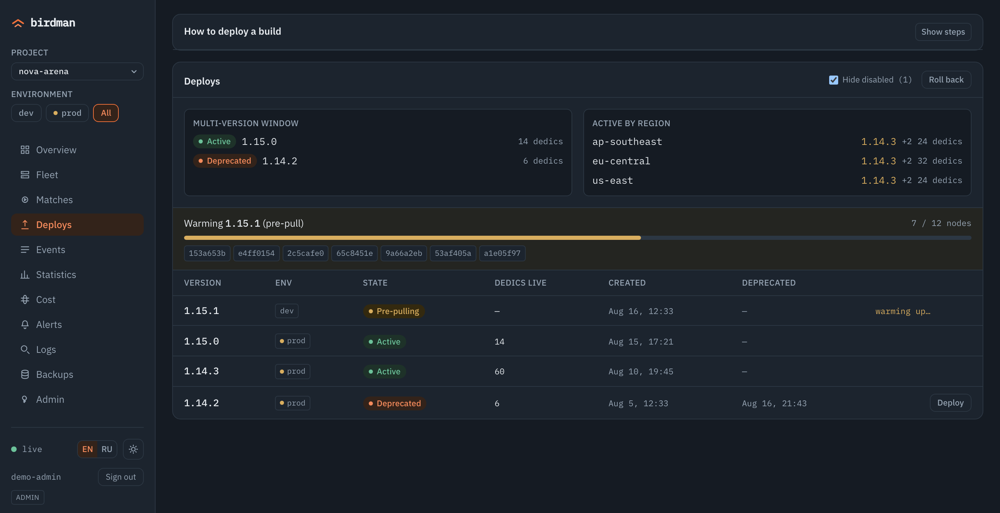

<!-- NB: bilingual pair — правишь один, правь второй (README.md ↔ README.ru.md). -->
# birdman

**Лёгкий рантайм хостинга выделенных серверов для сессионных мультиплеерных игр — без Kubernetes.**

[](https://github.com/ufna/birdman/actions/workflows/agent.yml)
[](https://github.com/ufna/birdman/actions/workflows/master.yml)
[](https://github.com/ufna/birdman/actions/workflows/panel.yml)
[](https://github.com/ufna/birdman/actions/workflows/sdk.yml)
[](LICENSE)

English: [README.md](README.md)

<p align="center">
  
  <br>
  <em>Overview — живой флот с одного взгляда: матчи, игроки, тёплый буфер, ноды и лента событий в реальном времени.</em>
  <br>
  <sub><i>Скриншоты панели сняты на встроенном демо-наборе (<code>npm run dev:demo</code> в <code>panel/</code>), а не на боевом флоте.</i></sub>
</p>

birdman поднимает ваш собственный флот выделенных игровых серверов — матчмейкинг, аллокацию, деплои и наблюдаемость — без Kubernetes. Это три взаимодействующих части: **master** (матчмейкер + управление флотом + REST API + админ-панель), **агент** на каждой машине, запускающий дедики как контейнеры containerd, и **SDK** в самом дедике, с которым линкуется игровой сервер. Linux-only, session-based (короткие матчи, а не персистентные миры). Построен для наших собственных игр и открыт под MIT.

## Возможности

- **Тёплый пул, аллокация за миллисекунды.** Готовые дедики ждут в буфере — матч получает `host:port` за миллисекунды, а не за холодный старт контейнера.
- **Мягкие мультиверсионные деплои.** Выкатывайте новый билд с двумя живыми версиями сразу, плавно дренируйте старую, мгновенно откатывайтесь — не обрывая идущие матчи.
- **Матчмейкер с учётом региона и RTT.** Тикеты размещаются по региону и по реально измеренному round-trip времени до флота.
- **Несколько игр и окружений на одной установке.** Проекты и окружения — измерение первого класса: ноды, версии, матчи, события, метрики и логи принадлежат ровно одной паре `(проект, окружение)`, каждый экран сужается по выбранному скоупу, а API-ключ, привязанный к паре, не дотянется ни до чего снаружи неё.
- **mTLS-линк агента.** Ноды энроллятся во встроенную CA и дозваниваются до master по mTLS gRPC — игровым машинам не нужен входящий admin-порт.
- **Секреты шифруются at-rest.** Токены реестров и ключ внутренней CA запечатаны AES-256-GCM.
- **Центральная наблюдаемость.** Логи каждого дедика, метрики флота и алерты в одном месте; история логов переживает reap серверов.
- **Бекапы Postgres с копией вне площадки.** Дампы по расписанию с локальным ретеншном и опциональной выгрузкой в S3; расписание, история, сбои и запуск руками — в панели, а протухший бекап поднимает алерт.
- **Изолированный оверлей control-plane.** Опциональный WireGuard-оверлей уводит трафик master↔нода с публичного интернета.
- **Двуязычная админ-панель.** Реалтайм: флот, матчи, деплои, статистика, стоимость и алерты — English/Русский, светлая/тёмная, встроена в бинарь master.
- **Self-host одной командой.** `docker compose up` поднимает master и Postgres с уже вшитой панелью.
- **AI-ready по построению.** Master сам является MCP-сервером, а его контракт OpenAPI 3.1 генерируется из роутера — агент управляет флотом без отдельной интеграции, которую надо ставить и версионировать.

## Две версии живут одновременно

Новый билд не заменяет работающий — он встаёт рядом. birdman пре-пулит образ на каждой ноде, переключает флот, когда пул доехал, и даёт прошлой версии *слиться*: её дедики доигрывают уже взятые матчи и исчезают по мере их окончания. Никого не выкидывает из игры. Откат — тот же приём в обратную сторону.

<p align="center">
  
  <br>
  <em>Деплои — 1.15.0 и 1.14.3 активны обе, 1.14.2 сливает последние шесть дедиков, 1.15.1 пре-пулится по флоту.</em>
</p>

## Чем занят флот

Логи каждого дедика, метрики флота и алерты приходят в одно место. master проксирует VictoriaMetrics и VictoriaLogs, поэтому панель никогда не ходит в ваш мониторинг напрямую, а история логов переживает серверы, которые её написали.

<p align="center">
  
  <br>
  <em>Статистика — игроки, идущие матчи, глубина очереди и утилизация слотов за сутки, ниже — дедики по состояниям.</em>
</p>

## Быстрый старт

Поднять master (REST API + админ-панель + Postgres) через Docker Compose. Нужны только Docker и Docker Compose v2.

```bash
git clone https://github.com/ufna/birdman.git && cd birdman/deploy
cp .env.example .env                                  # 1. задай POSTGRES_PASSWORD (не оставляй change-me)
umask 077 && openssl rand -base64 32 > secrets.key    # 2. ключ шифрования секретов at-rest
docker compose up -d --build                          # 3. собрать и запустить (postgres + master)
docker compose logs master | grep 'bootstrap admin'   # 4. admin-ключ (bmk_…) — показан ОДИН раз, сохрани
# затем открой http://127.0.0.1:8100 в браузере        # 5. панель + REST (только localhost хоста)
```

Ввод игровых нод, выкат билда и первый матч: [docs/self-host.ru.md](docs/self-host.ru.md).

Хотите посмотреть панель, ничего не устанавливая? `cd panel && npm ci && npm run dev:demo` откроет её на встроенном демо-флоте — без master, без базы, без нод.

## Архитектура

У birdman три подвижных части и одно твёрдое правило про трафик.

- **master** (Go + Postgres) — мозг: матчмейкер, reconcile флота (тёплый пул, деплои, drain), REST + SSE API, `/metrics` и встроенная админ-панель (`go:embed`).
- **agent** работает на каждой игровой машине поверх containerd. Запускает и супервизит дедики как контейнеры, назначает порты из пула, шипует их логи и метрики.
- **SDK** — небольшая C++-библиотека — линкуется в дедик. Сообщает агенту lifecycle, игроков и tick-метрики через локальный unix-сокет; сети и токенов внутри контейнера нет.

**Control-plane и игровой трафик — разные пути.** Агент дозванивается *наружу* до master по mTLS gRPC, поэтому у нод нет входящего admin-порта, а master — единственный публичный управляющий адрес; Postgres — единственный источник истины. **Игроки коннектятся напрямую к `host:port` дедика** — игровой трафик никогда не идёт через master, поэтому рестарт master не прерывает живой матч.

**birdman аутентифицирует инфраструктуру, а не игроков.** У операторов и сервисов
— API-ключи со скоупами, у нод — mTLS-серты, но `player_id` в matchmaking-тикете
это непрозрачная строка, которой master доверяет и которую не сохраняет в базу. Поэтому
ключ `matchmaking` предназначен бэкенду игры — он аутентифицирует игрока и заводит
тикет от его имени, — а не игровому клиенту. Подробнее: [гайд по
self-host](docs/self-host.ru.md), «Ключ `matchmaking` и `player_id`».

Полные спеки компонентов: [docs/specs/architecture.md](docs/specs/architecture.md).

## ИИ-агенты

**Запущенный master сам является MCP-сервером.** Наведите MCP-клиент на
`POST /v1/mcp` (streamable HTTP) с обычным API-ключом birdman — и агент видит
матчи, ноды, дедики, события, алерты, логи и метрики, а если разрешите — дренит
ноду и катит билд.

```bash
claude mcp add --transport http birdman https://ваш-master.example/v1/mcp \
  --header "Authorization: Bearer bmk_..."
```

Ставить нечего и версию отдельно вести не нужно: эндпоинт живёт внутри того же
бинаря master, который у вас уже работает.

**Права агента — это права ключа.** `tools/list` собирается на каждый запрос из
скоупов предъявленного ключа, поэтому `readonly`-ключ пишущих инструментов не
видит вовсе: не тратит на них контекст и не может попытаться их позвать. Пишущие
инструменты закрыты, пока оператор не включит `mcp.write_enabled` (по умолчанию
`false`): «пустить агента менять флот» — решение другого рода, чем выдать скоуп,
и заслуживает отдельного рубильника. Ключ, привязанный к паре
`(проект, окружение)`, и здесь не дотянется ни до чего снаружи неё.

**Инструменты не могут разъехаться с API**, потому что вызов инструмента и есть
вызов API: обработчик собирает настоящий HTTP-запрос и прогоняет его через
собственный роутер master'а — ключом вызывающего. Авторизация, сужение по
тенанту, рейтлимиты и формат ошибок наследуются, а не переписываются заново, и
тест краснеет, если инструмент называет ручку, которой у роутера нет.

**Есть машиночитаемый контракт.** OpenAPI 3.1 —
[`master/api/openapi.yaml`](master/api/openapi.yaml), живой master отдаёт его на
`GET /v1/openapi.yaml`. Он *генерируется* из той же таблицы маршрутов, из
которой регистрируется роутер, поэтому разойтись с кодом молча не может, а CI
падает, если закоммиченный файл отстал. Описаны все пути, методы, требуемые
скоупы, коды успеха и тела ответов; query-параметры и тела запросов пока не
описаны.

**Агенту-контрибьютору тоже есть карта:** в [AGENTS.md](AGENTS.md) — команды
сборки и тестов, устройство репозитория и правила, которых по коду не видно, а
[llms.txt](llms.txt) перечисляет документы с явной пометкой языка.


## Статус

Построен для наших собственных игр, затем открыт. Итерации 0–5 реализованы и приняты на живом мульти-нодовом флоте: матчмейкинг, тёплый пул, мультиверсионные деплои с откатом и drain, наблюдаемость, mTLS-энролл агентов, шифрование секретов at-rest и второй регион через изолированный оверлей. После этого платформа стала мультиарендной — проекты и окружения с ключами, привязанными к паре, — и обзавелась бекапами Postgres по расписанию с выгрузкой в S3. Это молодой софт, заточенный под наши нужды — ждите шероховатостей и API, которые ещё могут меняться.

## Документы

| Документ | Что внутри |
|---|---|
| [Гайд по self-host](docs/self-host.ru.md) | От `git clone` до первого матча: master (`deploy/`), первая нода (`infra/add-node.sh`), выкат версии и матч (`mmcli`). |
| [Спеки компонентов](docs/specs/README.md) | master, agent, SDK, протоколы, панель, ops/CI — референс-спеки. |
| [Скриншоты панели](tools/panelshots/README.md) | Как картинки выше снимаются с демо-набора панели. |
| [AGENTS.md](AGENTS.md) | Как собирать, проверять и менять этот репозиторий — писалось для ИИ-агентов, годится и человеку *(на английском)*. |
| [Контракт OpenAPI](master/api/openapi.yaml) | REST API мастера, сгенерированный из его таблицы маршрутов; живой master отдаёт его на `/v1/openapi.yaml`. |
| [Как контрибьютить](CONTRIBUTING.md) | Как предложить изменение и что скорее всего не примут *(на английском)*. |
| [Политика безопасности](SECURITY.md) | Как сообщить об уязвимости и что входит в скоуп *(на английском)*. |
| [LICENSE](LICENSE) | MIT. |

Комментарии в коде местами ссылаются на внутренние проектные заметки (`docs/superpowers/...`) — они живут в приватном репозитории-спутнике; публичные спеки — в `docs/specs/`.

## Лицензия

[MIT](LICENSE) © 2026 ufna.
