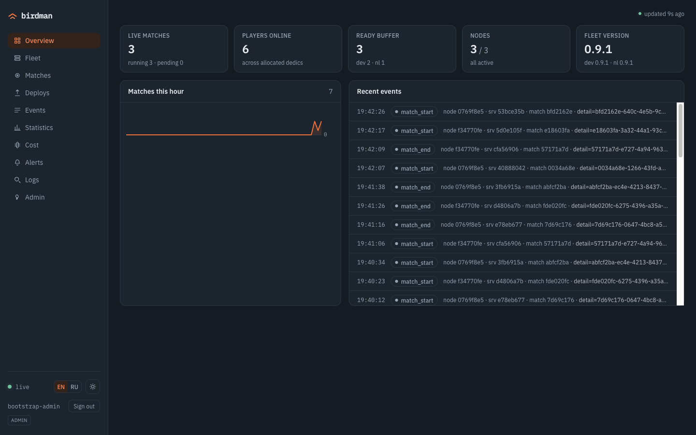
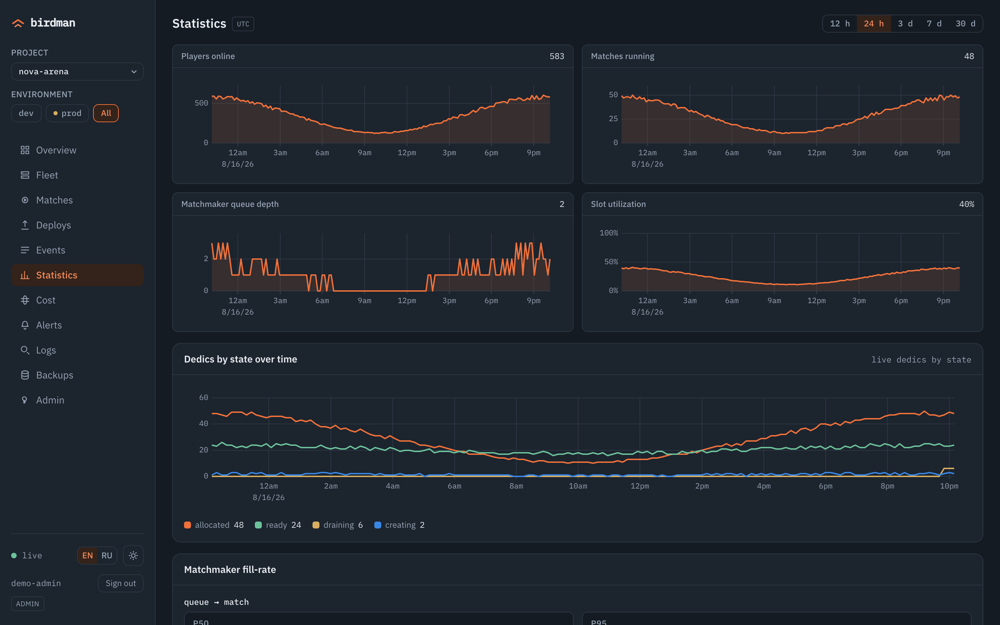

<!-- NB: bilingual pair — правишь один, правь второй (README.md ↔ README.ru.md). -->
# birdman

**Лёгкий рантайм хостинга выделенных серверов для сессионных мультиплеерных игр — без Kubernetes.**

[](https://github.com/ufna/birdman/actions/workflows/agent.yml)
[](https://github.com/ufna/birdman/actions/workflows/master.yml)
[](https://github.com/ufna/birdman/actions/workflows/panel.yml)
[](https://github.com/ufna/birdman/actions/workflows/sdk.yml)
[](LICENSE)

English: [README.md](README.md)

birdman поднимает ваш собственный флот выделенных игровых серверов — матчмейкинг, аллокацию, деплои и наблюдаемость — без Kubernetes. Это три взаимодействующих части: **master** (матчмейкер + управление флотом + REST API + админ-панель), **агент** на каждой машине, запускающий дедики как контейнеры containerd, и **SDK** в самом дедике, с которым линкуется игровой сервер. Linux-only, session-based (короткие матчи, а не персистентные миры). Построен для наших собственных игр и открыт под MIT.

<p align="center">
  
  <br>
  <em>Overview — живой флот с одного взгляда.</em>
</p>

<p align="center">
  
  <br>
  <em>Statistics — игроки, матчи, глубина очереди и утилизация во времени.</em>
</p>

## Возможности

- **Тёплый пул, аллокация за миллисекунды.** Готовые дедики ждут в буфере — матч получает `host:port` за миллисекунды, а не за холодный старт контейнера.
- **Мягкие мультиверсионные деплои.** Выкатывайте новый билд с двумя живыми версиями сразу, плавно дренируйте старую, мгновенно откатывайтесь — не обрывая идущие матчи.
- **Матчмейкер с учётом региона и RTT.** Тикеты размещаются по региону и по реально измеренному round-trip времени до флота.
- **mTLS-линк агента.** Ноды энроллятся во встроенную CA и дозваниваются до master по mTLS gRPC — игровым машинам не нужен входящий admin-порт.
- **Секреты шифруются at-rest.** Токены реестров и ключ внутренней CA запечатаны AES-256-GCM.
- **Центральная наблюдаемость.** Логи каждого дедика, метрики флота и алерты в одном месте; история логов переживает reap серверов.
- **Изолированный оверлей control-plane.** Опциональный WireGuard-оверлей уводит трафик master↔нода с публичного интернета.
- **Двуязычная админ-панель.** Реалтайм: флот, матчи, деплои, статистика, стоимость и алерты — English/Русский, светлая/тёмная, встроена в бинарь master.
- **Self-host одной командой.** `docker compose up` поднимает master и Postgres с уже вшитой панелью.

## Быстрый старт

Поднять master (REST API + админ-панель + Postgres) через Docker Compose. Нужны только Docker и Docker Compose v2.

```bash
git clone https://github.com/ufna/birdman.git && cd birdman/deploy
cp .env.example .env                                  # 1. задай POSTGRES_PASSWORD (не оставляй change-me)
umask 077 && openssl rand -base64 32 > secrets.key    # 2. ключ шифрования секретов at-rest
docker compose up -d --build                          # 3. собрать и запустить (postgres + master)
docker compose logs master | grep 'bootstrap admin'   # 4. admin-ключ (bmk_…) — показан ОДИН раз, сохрани
# затем открой http://127.0.0.1:8100 в браузере        # 5. панель + REST (только localhost хоста)
```

Ввод игровых нод, выкат билда и первый матч: [docs/self-host.ru.md](docs/self-host.ru.md).

## Архитектура

У birdman три подвижных части и одно твёрдое правило про трафик.

- **master** (Go + Postgres) — мозг: матчмейкер, reconcile флота (тёплый пул, деплои, drain), REST + SSE API, `/metrics` и встроенная админ-панель (`go:embed`).
- **agent** работает на каждой игровой машине поверх containerd. Запускает и супервизит дедики как контейнеры, назначает порты из пула, шипует их логи и метрики.
- **SDK** — небольшая C++-библиотека — линкуется в дедик. Сообщает агенту lifecycle, игроков и tick-метрики через локальный unix-сокет; сети и токенов внутри контейнера нет.

**Control-plane и игровой трафик — разные пути.** Агент дозванивается *наружу* до master по mTLS gRPC, поэтому у нод нет входящего admin-порта, а master — единственный публичный управляющий адрес; Postgres — единственный источник истины. **Игроки коннектятся напрямую к `host:port` дедика** — игровой трафик никогда не идёт через master, поэтому рестарт master не прерывает живой матч.

Полные спеки компонентов: [docs/specs/architecture.md](docs/specs/architecture.md).

## Статус

Построен для наших собственных игр, затем открыт. Итерации 0–5 реализованы и приняты на живом мульти-нодовом флоте: матчмейкинг, тёплый пул, мультиверсионные деплои с откатом и drain, наблюдаемость, mTLS-энролл агентов, шифрование секретов at-rest и второй регион через изолированный оверлей. Это молодой софт, заточенный под наши нужды — ждите шероховатостей и API, которые ещё могут меняться.

## Документы

| Документ | Что внутри |
|---|---|
| [Гайд по self-host](docs/self-host.ru.md) | От `git clone` до первого матча: master (`deploy/`), первая нода (`infra/add-node.sh`), выкат версии и матч (`mmcli`). |
| [Спеки компонентов](docs/specs/README.md) | master, agent, SDK, протоколы, панель, ops/CI — референс-спеки. |
| [LICENSE](LICENSE) | MIT. |

Комментарии в коде местами ссылаются на внутренние проектные заметки (`docs/superpowers/...`) — они живут в приватном репозитории-спутнике; публичные спеки — в `docs/specs/`.

## Лицензия

[MIT](LICENSE) © 2026 Vladimir Alyamkin.
